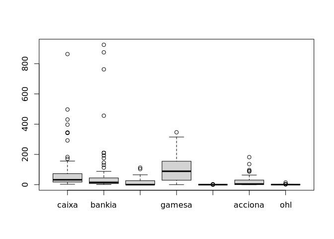
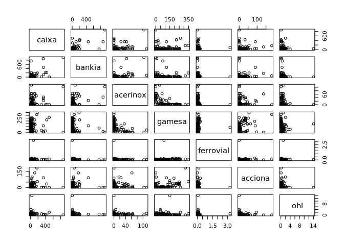
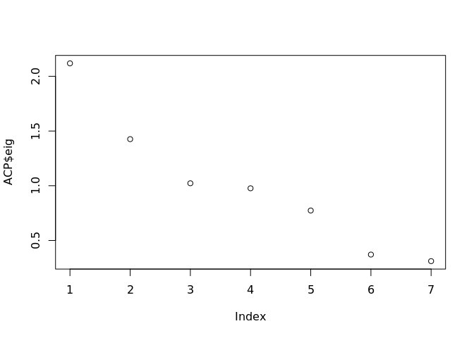
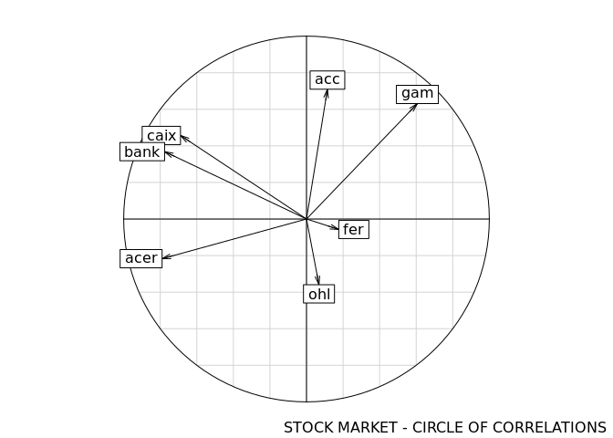

<!-- README.md is generated from README.Rmd. Please edit that file -->

# Principal-component-analysis

We will study the actions of the Spanish stock market: Acerinox, Gamesa,
Ferrovial, Acciona, Ohl.

Our client invests in caixa and bankia, whose dependency we have already
verified.

Our client currently wishes to invest in other of those indicated here.
To do this, we will check whether caixa and bankia are part of the same
component or not. And which other actions fit with them, to invest in
this or these components formed by the actions we are looking for.

The data of the actions are collected, their averages during the last
two years.

## We will calculate the Principal Component Analysis.

    #>      caixa            bankia          acerinox          gamesa     
    #>  Min.   :  3.00   Min.   :  1.00   Min.   :  0.00   Min.   :  0.0  
    #>  1st Qu.: 17.10   1st Qu.:  7.00   1st Qu.:  0.00   1st Qu.: 29.2  
    #>  Median : 32.10   Median : 15.00   Median :  0.00   Median : 88.6  
    #>  Mean   : 79.55   Mean   : 67.71   Mean   : 14.89   Mean   :104.9  
    #>  3rd Qu.: 72.95   3rd Qu.: 44.50   3rd Qu.: 26.30   3rd Qu.:154.9  
    #>  Max.   :863.60   Max.   :925.00   Max.   :112.20   Max.   :346.3  
    #>    ferrovial         acciona             ohl         
    #>  Min.   :0.0000   Min.   :  0.000   Min.   : 0.0000  
    #>  1st Qu.:0.0100   1st Qu.:  0.405   1st Qu.: 0.1000  
    #>  Median :0.0700   Median :  3.890   Median : 0.3000  
    #>  Mean   :0.1033   Mean   : 18.671   Mean   : 0.7353  
    #>  3rd Qu.:0.0900   3rd Qu.: 30.280   3rd Qu.: 0.8500  
    #>  Max.   :3.2400   Max.   :181.840   Max.   :14.0000
    #>       caixa      bankia    acerinox      gamesa   ferrovial     acciona 
    #> 131.9494238 164.4182150  23.7957126  86.3571312   0.3455991  30.8205446 
    #>         ohl 
    #>   1.6074629

<!-- -->

    #>                 caixa      bankia    acerinox      gamesa   ferrovial
    #> caixa      1.00000000  0.64003924  0.30769133 -0.05314741 -0.02252190
    #> bankia     0.64003924  1.00000000  0.37708685 -0.18747823 -0.08788324
    #> acerinox   0.30769133  0.37708685  1.00000000 -0.57679078 -0.11602016
    #> gamesa    -0.05314741 -0.18747823 -0.57679078  1.00000000  0.04488261
    #> ferrovial -0.02252190 -0.08788324 -0.11602016  0.04488261  1.00000000
    #> acciona    0.06447231  0.04600109 -0.04479813  0.31323921 -0.04796476
    #> ohl       -0.03364085 -0.07493465 -0.04819095 -0.04791087  0.00294428
    #>               acciona         ohl
    #> caixa      0.06447231 -0.03364085
    #> bankia     0.04600109 -0.07493465
    #> acerinox  -0.04479813 -0.04819095
    #> gamesa     0.31323921 -0.04791087
    #> ferrovial -0.04796476  0.00294428
    #> acciona    1.00000000 -0.12709668
    #> ohl       -0.12709668  1.00000000

<!-- -->

    #>       inertia      cum    cum(%)
    #> Ax1 2.1184343 2.118434  30.26335
    #> Ax2 1.4258834 3.544318  50.63311
    #> Ax3 1.0225731 4.566891  65.24130
    #> Ax4 0.9768209 5.543712  79.19588
    #> Ax5 0.7738232 6.317535  90.25050
    #> Ax6 0.3712137 6.688749  95.55355
    #> Ax7 0.3112513 7.000000 100.00000

<!-- -->

    #>                   CS1         CS2
    #> caixa     -0.47361735  0.38260248
    #> bankia    -0.53329989  0.30845708
    #> acerinox  -0.54273946 -0.18170832
    #> gamesa     0.41668926  0.52851881
    #> ferrovial  0.12121410 -0.04769864
    #> acciona    0.07867777  0.59430269
    #> ohl        0.04689047 -0.30107919
    #> [1] 0.3026335
    #> [1] 0.5063311
    #> [1] 0.652413

<!-- -->

We have performed a Principal Component Analysis. It has been proven
that Bankia and Caxia actually fit into the same component when making
the circle of correlations. 3 components were taken, which are the ones
with the greatest weight. And according to the results of the
eigenvectors, investment in gamesa can be recommended as it has a
positive weight of 0.4166.
